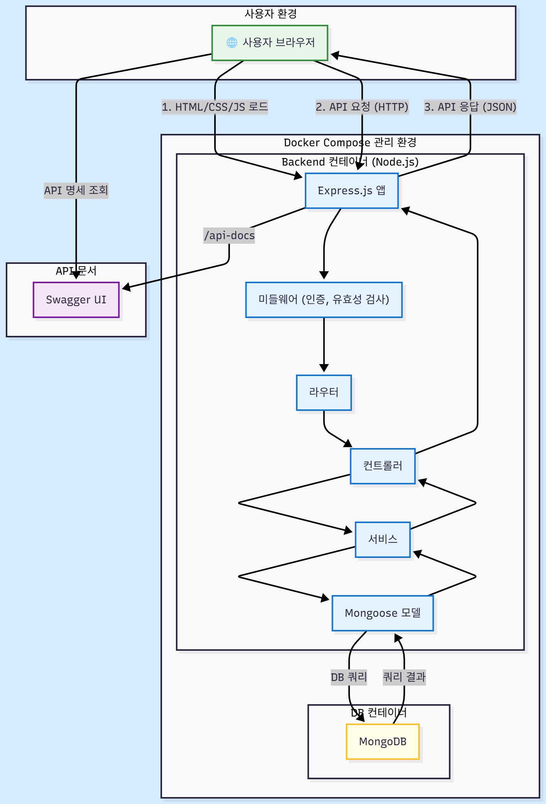

# 예산 기반 메뉴 찾기 웹서비스 (Budget Meal Finder)

---

## 프로젝트 소개 및 개발배경

다른 사용자가 추가한 주변의 메뉴를 빠르게 찾아 식사 메뉴 선택에 도움을 주는 Full-Stack 웹서비스입니다.

이 서비스는 다음의 문제를 해결하고자 개발되었습니다:

- 자신도 몰랐던 근처의 맛집 메뉴 탐색에 도움이 되도록
- 나만 알기 아까운 숨은 메뉴를 다른 사람들과 공유할 수 있도록
- 학생과 같이 지갑 사정이 여유롭지 않은 사람들이 가성비 메뉴를 쉽게 찾을 수 있도록

---

## 주요 기능

### 1. 사용자 인증
- JWT 기반 회원가입/로그인/로그아웃
- 역할 기반 권한 관리 (user / admin)

### 2. CRUD 기반 메뉴 관리
- 메뉴 등록 / 수정 / 삭제

### 3. 검색
- 키워드를 통해 메뉴 검색

### API 문서화
- Swagger UI 제공  
- 코드 변경 시 최신 API 명세 반영 자동화

---

## 프로젝트 데모

### 주요 화면
(여기에 서비스 화면 이미지 또는 GIF 삽입)
예시:
- 로그인 / 회원가입 UI  
- 메뉴 등록 화면  
- 검색 화면  
- Swagger API 문서 화면  
- 등등,,,

---

## 기술 스택

### Backend
- Node.js : 비동기 이벤트 기반 구조로 여러 사용자의 I/O를 처리하는 이런 프로젝트에 적합함.
- Express.js : Node.js에서 사용하는 가볍고 유연한 웹 프레임워크로, REST API 서버를 신속하게 구축 가능.
- JWT 인증 : 서버의 무상태(Stateless) 유지, 가볍고 확장성이 용이함.

### Database
- MongoDB : MongoDB는 JSON과 유사한 문서 기반 구조(BSON)를 사용해 JavaScript 객체를 그대로 DB에 저장하거나 읽을 수 있어 Node.js와 자연스럽게 통합된다.

### Frontend
- JavaScript(Vanilla) / HTML / CSS  : 빠른 개발 진행을 위해 웹의 기본 기술만을 이용하여 필요한 부분만 최소한으로 구현함.

### Infra & Tools
- Docker, Docker Compose : 컨테이너 기반으로 구성하여 개발·배포 환경의 일관성을 보장하고, 손쉽게 실행·중지·배포할 수 있는 유연한 환경을 구축하기 위해 사용.
- Swagger (swagger-ui-express, swagger-jsdoc) :REST API 문서를 코드 기반으로 자동 생성하여 문서의 최신 상태를 유지하고, 브라우저에서 직접 API를 테스트할 수 있는 시각적이고 인터랙티브한 문서 환경을 제공.

---

## 아키텍처

### 시스템 구조도

### 계층형 구조 (Layered Architecture)
백엔드는 **관심사 분리(Separation of Concerns)** 원칙에 따라 **핸들러-컨트롤러-서비스-리포지토리**의 계층형 구조로 설계되었습니다. 각 계층은 명확한 책임을 가지며, 이를 통해 코드의 유지보수성과 테스트 용이성을 높였습니다.

---

## 주요 기술적 과제 및 해결 과정

이 프로젝트를 진행하며 마주친 주요 기술적 과제들과 이를 해결하기 위한 노력은 다음과 같습니다.

### 1. 백엔드 아키텍처 및 API 설계

-   **계층형 구조 설계**
    -   **문제:** 프로젝트 초기, 모든 비즈니스 로직과 데이터베이스 접근 코드가 컨트롤러에 집중되어 코드의 가독성, 테스트, 재사용성이 저하되는 '거대 컨트롤러(Fat Controller)' 현상이 발생했습니다.
    -   **해결:** '관심사 분리(SoC)' 원칙에 따라 **핸들러-컨트롤러-서비스-리포지토리**의 계층형 아키텍처를 도입하여 각 계층이 명확한 책임을 갖도록 설계했습니다.
    -   **결과:** 코드의 유지보수성과 테스트 용이성이 크게 향상되었으며, 핵심 비즈니스 로직을 여러 곳에서 재사용할 수 있는 확장 가능한 구조를 확립했습니다.

-   **일관성 있는 API 에러 처리**
    -   **문제:** API 엔드포인트마다 에러 처리 방식과 응답 형식이 달라, 에러를 식별하고 처리하는 데 어려움을 겪고 디버깅 시간이 길어졌습니다.
    -   **해결:** 커스텀 `ApiError` 클래스와 전역 `errorHandler` 미들웨어를 구현하여 에러 처리를 중앙화하고 응답 형식을 표준화했습니다.
    -   **결과:** 모든 API가 일관된 형식의 에러를 반환하게 되어 문제 원인 파악이 용이해지고, 이를 통해 개발 효율 증대 및 디버깅 시간 단축 효과를 얻었습니다.

-   **API 문서 자동화**
    -   **문제:** 코드 변경 시 API 문서가 수동으로 업데이트되지 않아, 개발 간 비효율이 발생했습니다.
    -   **해결:** `Swagger`를 도입하여 코드 내 JSDoc 주석을 기반으로 API 문서를 자동으로 생성하고, 인터랙티브 테스트 환경을 제공했습니다.
    -   **결과:** 항상 최신 상태의 API 명세를 유지하여 개발자 간의 커뮤니케이션 비용을 줄이고, 개발 생산성을 향상시켰습니다.

### 2. 데이터 관리 및 무결성

-   **데이터 모델링과 관계 설정**
    -   **문제:** `User`와 `Menu` 모델 간의 관계 설정이 비효율적이어서 데이터가 중복 저장될 수 있고, 연관된 데이터를 조회하는 로직이 복잡해질 우려가 있었습니다.
    -   **해결:** Mongoose의 `ref`와 `populate` 기능을 사용하여 모델 간의 참조 관계를 명확히 설정하고 데이터 정규화를 구현했습니다.
    -   **결과:** 데이터 중복을 최소화하여 일관성을 확보했으며, `populate`를 통해 복잡한 쿼리 없이도 관련 데이터를 쉽게 조회할 수 있어 개발 생산성을 높였습니다.

-   **서버 측 데이터 유효성 검증**
    -   **문제:** 신뢰할 수 없는 사용자 입력값이 그대로 데이터베이스에 저장될 위험이 있었고, 컨트롤러 내에 중복된 검증 코드가 흩어져 있었습니다.
    -   **해결:** `express-validator`를 활용한 유효성 검증 미들웨어를 도입하여, 컨트롤러 실행 전에 데이터의 형식과 조건을 일괄 검증했습니다.
    -   **결과:** 데이터 무결성 확보 및 시스템 안정성을 증대시켰고, 컨트롤러 로직을 단순화하여 가독성을 높였습니다.

### 3. 보안

-   **역할 기반 자원 접근 제어(RBAC)**
    -   **문제:** '일반 사용자'가 '관리자'만 사용해야 하는 메뉴 관리 API에 접근하는 등 역할에 맞지 않는 기능에 접근할 수 있는 보안 취약점이 존재했습니다.
    -   **해결:** JWT에 사용자의 역할(`userType`) 정보를 포함시키고, 라우팅 단계에서 이 역할을 확인하여 접근 권한을 제어하는 역할 기반 미들웨어를 구현했습니다.
    -   **결과:** 역할 기반 접근 제어(RBAC)를 통해 서비스의 보안을 강화하고 민감한 데이터를 보호했으며, 사용자의 역할에 따라 접근 가능한 기능을 명확하게 분리했습니다.

### 4. 성능 및 사용자 경험(UX) 최적화

-   **지도 렌더링 최적화 (마커 클러스터링)**
    -   **문제:** 지도에 표시할 데이터가 수백 개 이상으로 늘어날 경우, 모든 마커를 한 번에 렌더링하면서 발생하는 성능 저하와, 좁은 지역에 마커가 겹쳐 보이는 가독성 문제가 발생했습니다.
    -   **해결:** google maps 라이브러리에서 제공하는 **마커 클러스터링(Marker Clustering)** 기능을 적용하여, 가까운 마커들을 하나의 클러스터로 그룹화하고 사용자가 지도를 확대하면 자동으로 개별 마커로 나뉘어 보이도록 구현했습니다.
    -   **결과:** 한 번에 렌더링하는 마커의 수를 크게 줄여 지도의 조작 속도를 개선했으며, 깔끔한 마커 표시를 통해 사용자 경험(UX)을 향상시켰습니다.

-   **이미지 처리 및 업로드 경험 개선**
    -   **문제:** 사용자가 고용량의 원본 이미지를 그대로 업로드하여 발생하는 느린 페이지 로딩 속도와, '파일 찾기' 방식의 번거로운 업로드 과정이 문제였습니다.
    -   **해결:** 서버 단에서는 이미지 업로드 시 `sharp` 라이브러리를 통해 웹에 최적화된 크기로 자동 리사이징 및 압축하는 로직을 추가했습니다. 클라이언트 단에서는 클립보드 API를 활용하여 사용자가 이미지를 복사-붙여넣기(Ctrl+V)만으로 업로드할 수 있도록 구현했습니다.
    -   **결과:** 이미지 용량을 70% 이상 감소시켜 페이지 로딩 속도를 크게 개선했으며, 사용자에게는 파일 저장 및 탐색 과정 없이 단 한 번의 '붙여넣기'만으로 이미지를 등록할 수 있는 직관적이고 편리한 UX를 제공했습니다.